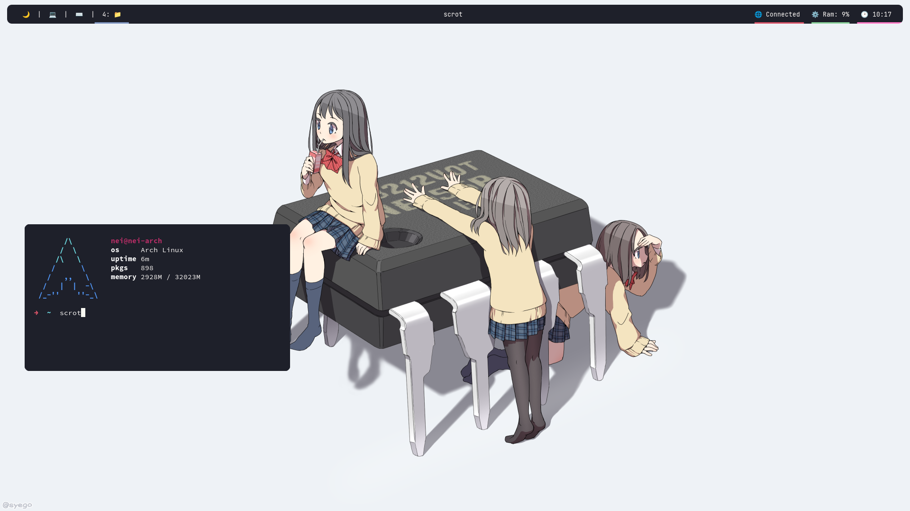

# dotfiles ✨

Config files for my arch linux desktop setup

## Information

- **OS:** [Arch Linux](https://archlinux.org)
- **CLI**

  - WM: [i3](https://i3wm.org/)
  - Shell: [zsh](https://wiki.archlinux.org/index.php/Zsh)
  - Fetcher : [Pfetch-btw](https://github.com/dylanaraps/pfetch)

- **GUI**

  - Terminal: [Alacritty](https://github.com/alacritty/alacritty)
  - Compositor: [picom](https://github.com/yshui/picom)
  - Application Launcher: [rofi](https://github.com/davatorium/rofi)
  - Dock: [Polybar](https://github.com/polybar/polybar)
  - Notification : [Dunst](https://github.com/dunst-project/dunst)
  - IDE : [Vscode](https://code.visualstudio.com/)
  - Discord-theme : [BetterDiscord](https://betterdiscord.app/)

# Installation

```
git clone https://github.com/nei7/dotfiles
cd dotfiles
chmod +x install.sh
./install.sh
```

# Preview


